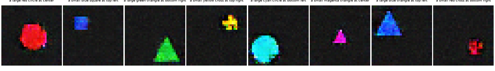

# Text-to-Image Generator (from words to pixels)

A small **text-conditioned GAN** that turns a sentence such as *"a large blue triangle at top left"* into a 32x32 image. Built from scratch in PyTorch to understand how words become pixels, and to test the question that matters for any text-to-image model: **does it compose concepts it has never seen together?**

## The world it lives in
Every image shows one shape: **size** (small/large) x **colour** (6) x **shape** (circle, square, triangle, cross) x **position** (5), rendered procedurally with jitter and noise (`textimg/scene.py`), so the exact description of every training image is known. That gives an honest test.

## Model (`textimg/model.py`)
- **Text encoder:** each word has a learned embedding and the sentence is the **sum** of its word embeddings. Order-free by design, so "blue" and "triangle" each contribute independently, which is what makes new combinations possible.
- **Generator:** noise + text embedding -> 4x4 -> 8x8 -> 16x16 -> 32x32 RGB (transposed convolutions, BatchNorm, tanh).
- **Discriminator:** image features with the text injected at 4x4 resolution, trained **matching-aware** (Reed et al. 2016): (real image, right text) = real; (generated image, text) = fake; **(real image, WRONG text) = fake**. The third case is what forces the model to care whether the image *matches the words*, not merely whether it looks like a plausible image.

